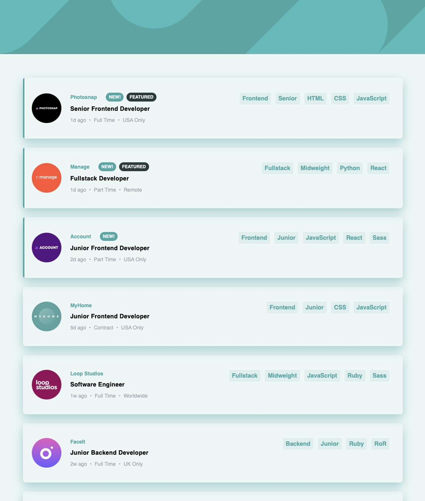
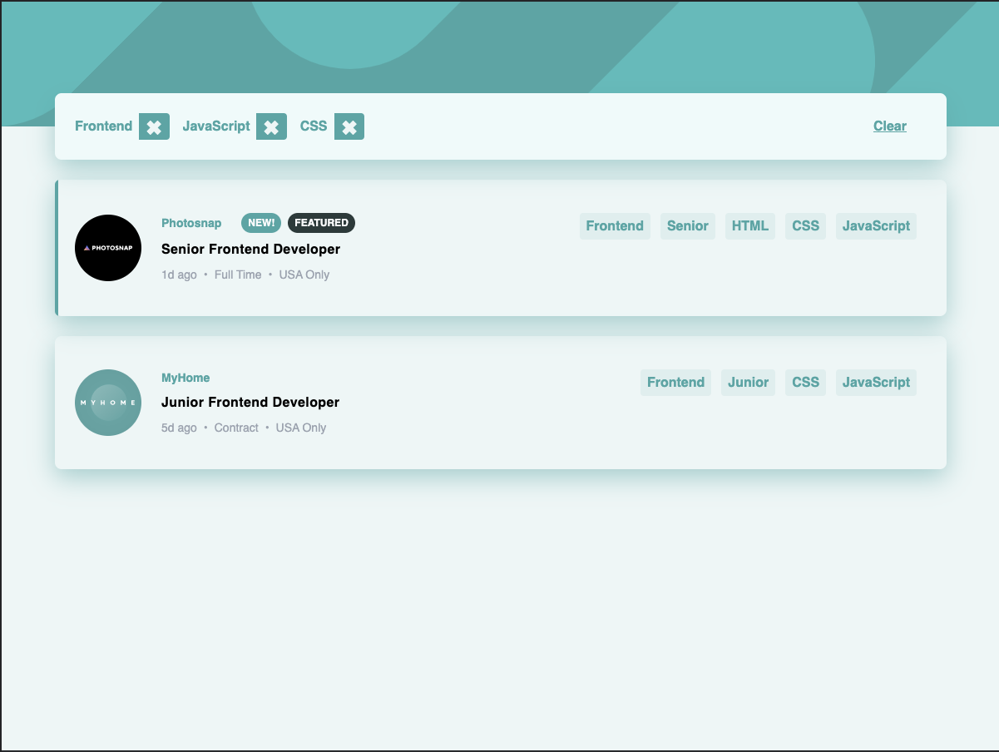
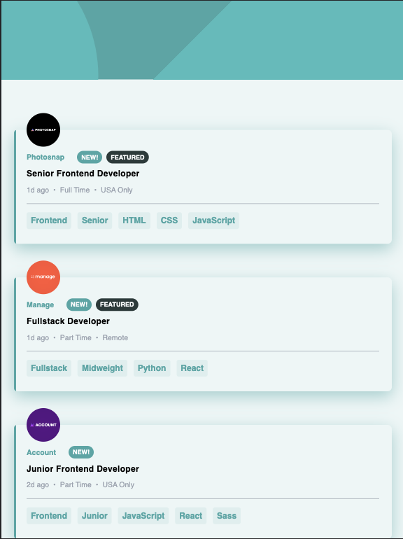
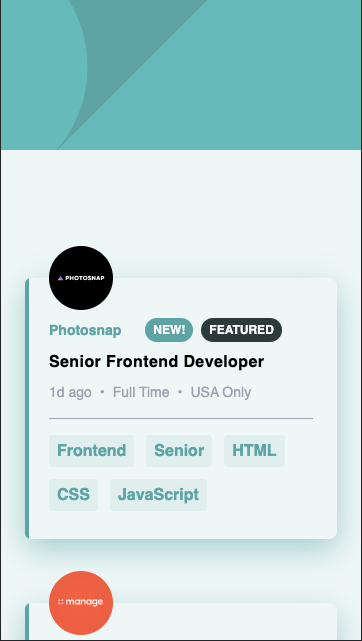
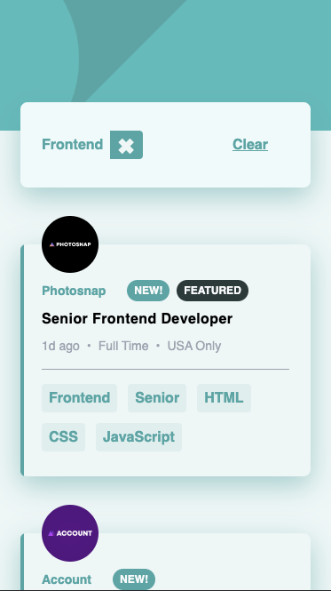

# Frontend Mentor - Job listings with filtering solution

This is a solution to the [Job listings with filtering challenge on Frontend Mentor](https://www.frontendmentor.io/challenges/job-listings-with-filtering-ivstIPCt). Frontend Mentor challenges help you improve your coding skills by building realistic projects. 

This project is a fictional job-board for a company I've named Jobarama. The project consists of one page, listing all of the 10 provided jobs in the data-set. The job listings can be filtered by their "tags" (role, level, languages, and/or tools). Upon selecting a filter, a filter summary/manangement panel appears at the top of the list. Multiple filters can be applied and filters can be removed from the management panel. Duplicate filters are excluded and the filters appear in the order they are selected.

## Table of contents

- [Overview](#overview)
  - [The challenge](#the-challenge)
  - [Screenshot](#screenshot)
  - [Links](#links)
- [My process](#my-process)
  - [Built with](#built-with)
  - [What I learned](#what-i-learned)
  - [Continued development](#continued-development)  
- [Author](#author)


## Overview

### The challenge

Users should be able to:

- View the optimal layout for the site depending on their device's screen size
- See hover states for all interactive elements on the page
- Filter job listings based on the categories

### Screenshots







### Links

- Solution URL: [Frontend Mentors](https://www.frontendmentor.io/solutions/nextjs-job-board-IvJIaGt5s)
- Live Site URL: [Hosted on Vercel](https://fem-static-job-listings-8lxpgh5ye-justin-m-morgan.vercel.app)

## My process


### Built with

- Semantic HTML5 markup
- Flexbox
- Mobile-first workflow
- [React](https://reactjs.org/) - JS library
- [Next.js](https://nextjs.org/) - React framework

### What I learned

#### Next.js and Vercel's deployment workflow
 
 I learned from this project was how to use NextJS and deploy using Vercel's Next-tailored deploy workflow. NextJS offers a productive solution to using React for static websitesUsing this workflow, preview deploys are generated from pull requests and rebuilds are triggered upon merging pull requests into the `master`/`main` branch.

#### Separation of Concerns

By leveraging small, composable functions, I was able to create clear API boundaries between my components. This can be seen especialy in the architecture of the `JobCard` component, which itself has many sub-components representing the various "blocks". Each "block" consumes a portion of the `job` data and renders a portion of the UI related to that information. These "blocks" are composed together with structural components, which control the layout at various viewports. And lastly, the "page" component coordinates state between the `Header` and `Body` components. 

#### Shared state with `useReducer`

In order to manage a shared state across two branches of the component tree, I made use of an orchestrating parent component and the `useReducer` hook provided by `React`. In the context, I decided to provide appropriate `dispatch` functions to each of my component brances via `props` rather than relying on `context` (which I felt would have been overboard). I designed my component tree to minimize the amount of "prop-drilling" that would be required to accomplish this.

In order to use the `useReducer` hook, I followed the introductory documentation on the [`React` website](https://reactjs.org/docs/hooks-reference.html#usereducer). Adapting the example to my context was trivial. The return value from the `useReducer` hook is the state and a `dispatch` function, which anticipates an `{type, payload}` object as its argument. I particularized the `dispatch`es to my contexts in order to minimize configuration within child components. 


```js
function addFilter(dispatch) {
  return function(key, value) {
    dispatch({type: "add-filter", payload: `${key}|${value}`})
  }
}
function removeFilter(dispatch) {
  return function(filterString) {
    dispatch({type: "remove-filter", payload: filterString})
  }
}
function clearFilters(dispatch) {
  return function() {
    console.log("Clicked Clear")
    dispatch({type: "clear-filters"})
  }
}
```

These higher-ordered functions can be provided to the component where the `dispatch` function is in scope, and will encapsulate it in its closure scope (returning a function which references the function in this closure-scope).

### Continued development

In my next project, I want to explore other styling options. In the context of `React`, I am aware of several CSS-in-JS options: [emotion](https://www.google.com/url?sa=t&rct=j&q=&esrc=s&source=web&cd=&cad=rja&uact=8&ved=2ahUKEwibzpnMj_XyAhVNpFsKHQQuCIAQFnoECA4QAw&url=https%3A%2F%2Femotion.sh%2Fdocs%2Fintroduction&usg=AOvVaw2trB-wVWOnHM6RkVmE0vuy), [styled-components](https://www.styled-components.com/), and [vanilla-extract](https://www.google.com/url?sa=t&rct=j&q=&esrc=s&source=web&cd=&cad=rja&uact=8&ved=2ahUKEwjy6OKdj_XyAhVNpFsKHQQuCIAQFnoECAkQAQ&url=https%3A%2F%2Fvanilla-extract.style%2F&usg=AOvVaw3mOGAmCOy66hbDwRg7S-wQ) to name a few. By exploring these libraries, I hope to expand my familiarity with the `React` ecosystem as well as to challenge myself to attempt more sophisticated `CSS` solutions than Tailwind readily allows. 

Though there was minimal requirements for component behaviour to test in this project, I will strive to explore component and unit testing in my next project.

Additionally, I will challenge myself to implement more complex shared state via a larger app.

## Author

- Frontend Mentor - [@justin-m-morgan](https://www.frontendmentor.io/profile/justin-m-morgan)
- Twitter - [@_catsonfilm](https://www.twitter.com/_catsonfilm)

